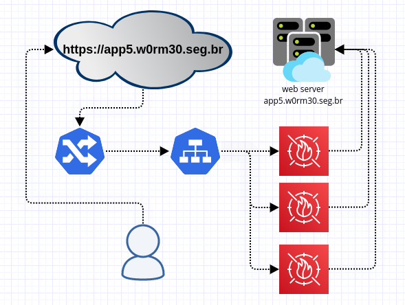

# PROXY PASS Nginx with mod_security 

[](https://quay.io/repository/laurobmb/mod_sec) 

This project has the purpose to provide an application level security using an open-source web application firewall [mod-security](https://www.modsecurity.org/), this security application is in the market for many years and keeps updating its rule lists and repositories. Also in this project we added rules that cover the items from [OWASP top 10](https://owasp.org/www-project-modsecurity-core-rule-set/), with this we try to reduce as much as possible the attack surface to the application.

Exist two work modes in PROXY, FORWARD PROXY and REVERSE PROXY. The mode reverse proxy need two variables to good work, FRONTEND and BACKEND, the mode forward proxy do not need this variables, if case fill this variables on mode forward proxy will be ignored.  



### Usage 

	podman pull quay.io/laurobmb/mod_sec:latest
    podman pull laurobmb/wafmodsec:latest

### Start POD

#### ENV definitions 
	
	MODE = { 1 or 2 } 
		1 = Proxy reverse mode
		2 = Proxy forward mode
	FRONTEND = dns that should receive the connections, the NGINX virtual host 
	BACKEND = destination webapp

#### POD command example

	podman run -it -p80:80 -p443:443 \
		-e MODE=1
		-e FRONTEND=app5.w0rm30.seg.br \	
		-e BACKEND="www2.recife.pe.gov.br" quay.io/laurobmb/mod_sec

	podman run -it -p80:80 -p443:443 -e MODE=1 quay.io/laurobmb/mod_sec


#### Start VM

#### Deploy Ansible host 

> ansible-playbook -e frontend=app5.w0rm30.seg.br -e backend=www2.recife.pe.gov.br ansible_modsecurity_install.yml

#### Remove Custom Rules

In this [script](files/scripts/remove_files_rules.sh), I am removing some things that for my scenario are useless, if you want to enjoy this project, check this [file](files/scripts/remove_files_rules.sh) before deploying to production

Also in this topic, this [script](files/scripts/remove_rules_id.py) is disabling rules with the configuration active, so any rule you want to disable, just put it in the array and restart the application

#### BlackList IP

This is possible to put a list of IP addresses to block in the WAF, this practice is not normal because it affects directly the WAF performance, I use it for temporary emergencies.
blacklist.txt](files/conf/blacklist.txt)

There is dynamic reputation list embedded in [CRS](https://github.com/coreruleset/coreruleset/blob/v3.4/dev/rules/REQUEST-910-IP-REPUTATION.conf) I believe it is much more effective in common situations

#### Security HEADERS 

The default proxy pass [template](files/conf.d/virtualHost.template) is enabling security headers for this project

	add_header Content-Security-Policy "default-src 'self';";
	add_header Strict-Transport-Security 'max-age=31536000; includeSubDomains; preload';
	add_header X-XSS-Protection "1; mode=block";
	add_header X-Frame-Options "SAMEORIGIN";
	add_header X-Content-Type-Options nosniff;
	add_header Referrer-Policy "strict-origin";
	add_header Permissions-Policy "geolocation=();midi=();notifications=();push=();sync-xhr=();microphone=();camera=();magnetometer=();gyroscope=();speaker=(self);vibrate=();fullscreen=(self);payment=();";

##### Security client

Still in [template](files/conf.d/virtualHost.template), I am deactivating the use of client as WGET to minimize automatic searches on the page.

	if ($http_user_agent ~* LWP::Simple|BBBike|wget) {
		return 403;
	}

	add_header Allow "GET, POST, HEAD" always;
	if ( $request_method !~ ^(GET|POST|HEAD)$ ) {
		return 405;
	}


#### Test

    http://app5.w0rm30.seg.br/?exec=/bin/bash
    http://app5.w0rm30.seg.br/?q="><script>alert(1)</script>"
    http://app5.w0rm30.seg.br/?id=3 or 'a'='a'
   

#### Log verify

> [root@4d16582f7e36 /]# cat /var/log/nginx/modsec_audit.log 

```
ModSecurity: Warning. Matched "Operator `Rx' with parameter `(?i:(?:<\w[\s\S]*[\s\/]|['\"](?:[\s\S]*[\s\/])?)(?:on(?:d(?:e(?:vice(?:(?:orienta|mo)tion|proximity|found|light)|livery(?:success|error)|activate)|r(?:ag(?:e(?:n(?:ter|d)|xit)|(?:gestur|leav)e|start|d (3146 characters omitted)' against variable `ARGS:q' (Value: `"><script>alert(1)</script>"' ) [file "/usr/local/nginx/conf/owasp-crs/rules/REQUEST-941-APPLICATION-ATTACK-XSS.conf"] [line "205"] [id "941160"] [rev ""] [msg "NoScript XSS InjectionChecker: HTML Injection"] [data "Matched Data: <script found within ARGS:q: "><script>alert(1)</script>""] [severity "2"] [ver "OWASP_CRS/3.2.0"] [maturity "0"] [accuracy "0"] [tag "application-multi"] [tag "language-multi"] [tag "platform-multi"] [tag "attack-xss"] [tag "paranoia-level/1"] [tag "OWASP_CRS"] [tag "OWASP_CRS/WEB_ATTACK/XSS"] [tag "WASCTC/WASC-8"] [tag "WASCTC/WASC-22"] [tag "OWASP_TOP_10/A3"] [tag "OWASP_AppSensor/IE1"] [tag "CAPEC-242"] [hostname "10.88.0.31"] [uri "/"] [unique_id "1601988438"] [ref "o2,7v8,28t:utf8toUnicode,t:urlDecodeUni,t:htmlEntityDecode,t:jsDecode,t:cssDecode,t:removeNulls"]
```

### Sources

* https://owasp.org/www-project-modsecurity-core-rule-set/
* https://www.modsecurity.org/
* https://www.nginx.com/blog/compiling-and-installing-modsecurity-for-open-source-nginx/