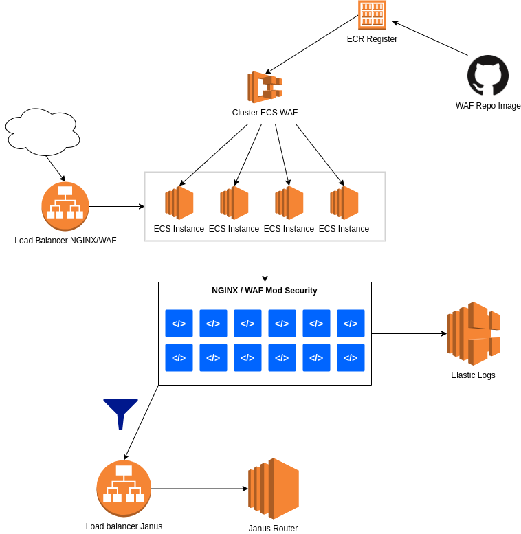

# PROXY PASS Nginx with mod_security 

### Start POD

#### env definitions 

	FRONTEND = dns that should receive the connections, the NGINX virtual host 
	BACKEND = destination webapp
	MODE = 1 or 2

#### POD command example

###### Build project
	docker build -t waf_project:latest .

###### Run project
	docker run --rm --name waf -it -p80:80 waf_project:latest

###### Run project on daemon
	docker run --restart=always --name waf -d -p80:80 waf_project:latest

###### resource limits

	docker run --restart=always --cpus=0.5 -m 512M -d --name waf -p80:80 waf_project:latest
	 
#### Test

	docker run -it --rm --cpus=0.5 -m 512M --name waf -p80:80 waf_alpine:latest

	http://www2.recife.pe.gov.br/?exec=/bin/bash
	http://www2.recife.pe.gov.br/?q=">"
	http://www2.recife.pe.gov.br/?id=3 or 'a'='a'

#### Status 

	docker stats --all --format "table {{.Container}}\t{{.CPUPerc}}\t{{.MemUsage}}" waf

